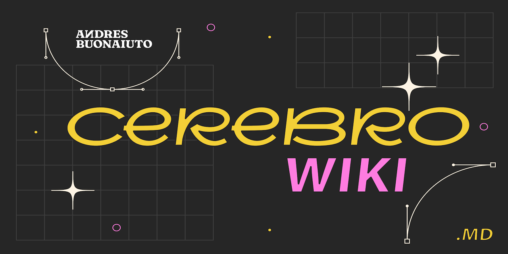
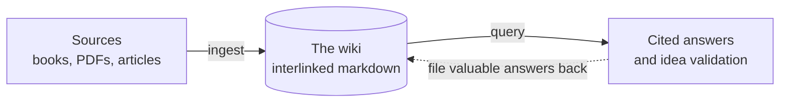

<!-- Drop the cover image at docs/assets/cover.png (wide banner, ~1280x640). -->


<h1 align="center">cerebro</h1>

<p align="center">
  <strong>Turn your books and PDFs into a knowledge base an AI keeps current, and cite it to make better decisions.</strong>
</p>

<p align="center">
  
  
  
</p>

---

Most "chat with your documents" tools rediscover your files on every question.
Nothing accumulates. Ask something subtle that spans five sources and the model
pieces it together from scratch, every time.

A **brain** works differently. The LLM reads each source once, distills it into a
structured, interlinked wiki of markdown pages, and **keeps that wiki current** as
you add more. The cross-references are already there. Contradictions are already
flagged. When you ask a question, the answer is cited and traceable to real
sources, never invented.

You curate the sources and ask the questions. The LLM does the reading,
summarizing, cross-referencing, and filing. You browse the result in
[Obsidian](https://obsidian.md/).

## How it works



Four operations, all in plain language:

- **Create** a brain for a topic (business, a book, a research thread).
- **Ingest** a source: the LLM reads it, writes a summary page, and updates every
  concept, entity, and synthesis page it touches.
- **Query** it: ask a question or validate an idea and get a cited answer that
  says "no coverage" instead of guessing when the brain does not know.
- **Lint** it: find contradictions, stale claims, orphan pages, and gaps.

## Quickstart

**Option A, with Claude (skill):**

1. Build the installable skill: `bash scripts/build-skill.sh`
2. In Claude (Desktop, Code, or claude.ai), install `dist/cerebro-skill.zip` as a
   skill.
3. Say: `create a brain for validating business ideas`. Then drop a PDF in its
   `sources/` folder and say `ingest it`.

**Option B, any filesystem agent (Codex, Cursor, Gemini CLI):**

1. Copy `templates/brain-structure/` to a new folder and fill in its `AGENTS.md`.
2. Point your agent at [`BLUEPRINT.md`](BLUEPRINT.md) and start ingesting.

**Option C, ChatGPT (query only):** paste
[`templates/custom-gpt-prompt.md`](templates/custom-gpt-prompt.md) into a Custom
GPT or Project and upload your brain's pages.

## See a real brain

[`examples/business-brain/`](examples/business-brain/) is a complete, browsable
brain built from two public-domain classics (Wattles' *The Science of Getting
Rich*, 1910, and Barnum's *The Art of Money Getting*, 1880). It shows the whole
pattern in action:

- Source notes, concept pages, author entities, and a cross-source
  [synthesis](examples/business-brain/wiki/synthesis/mindset-vs-method.md) with a
  documented **contradiction** the sources disagree on.
- An [idea validation](examples/business-brain/wiki/answers/take-a-loan-to-launch-faster.md)
  answer in the Supports / Contradicts / Not covered / Verdict format.
- Per-page confidence levels, so you can tell "both sources agree" from "one
  author's opinion".

Open the `examples/` folder as an Obsidian vault to see the graph.

## Fewer tokens: convert sources to markdown

Reading raw PDFs is expensive. `tools/convert.py` (a
[markitdown](https://github.com/microsoft/markitdown) wrapper) converts a source
to clean markdown once, and prints its token count so you can see the saving:

```bash
pip install -r tools/requirements.txt
python tools/convert.py sources/book.pdf -o sources/converted/book.md
```

The difference is largest on scanned or image-heavy PDFs.

## Credit

cerebro is an installable, opinionated implementation of the **LLM Wiki** pattern
described by **Andrej Karpathy**
([gist](https://gist.github.com/karpathy/442a6bf555914893e9891c11519de94f)). That
gist communicates the idea; this repo turns it into a ready-to-use kit and adds:

- A normative, step-by-step blueprint instead of an abstract description.
- An installable Claude skill and multi-AI templates.
- Per-page confidence levels and explicit contradiction handling.
- Anti-hallucination rules for querying ("no coverage" instead of inventing).
- An idea-validation output format.
- PDF to markdown conversion wired into the ingest step.

## License

[MIT](LICENSE) (c) 2026 Andres Buonaiuto
